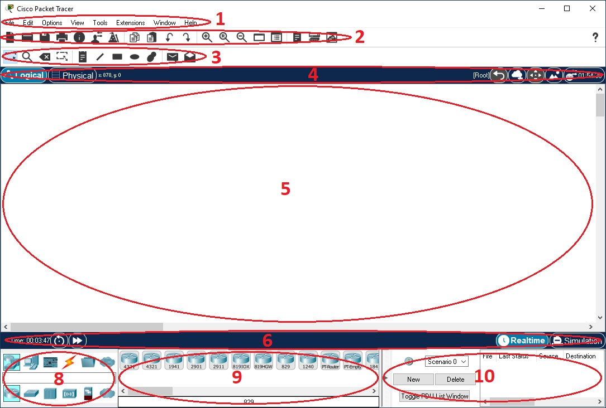
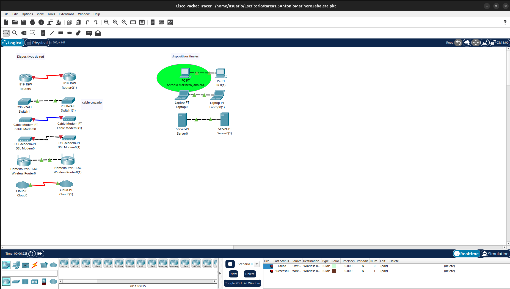

# Introducción a Packet Tracer

Packet Tracer es una herramienta gratuita de simulación y visualización de redes Cisco Packet Tracer. Permite practicar la configuración de red y habilidades de resolución de problemas. Simular redes sin tener acceso a equipos físicos. Además de la creación de redes, puede aprender y luego practicar sus habilidades de Internet de las cosas (IoT) y ciberseguridad. Puede elegir crear una red desde cero, usar una red de muestra prediseñada o completar tareas de laboratorio.

## Parte 1: Descarga de Cisco Packet Tracer

1. Visita el sitio web de Cisco Networking Academy:
- Abre tu navegador y dirígete a [Cisco Networking Academy](https://www.netacad.com/).

2. Crea una cuenta:
- Si no tienes una cuenta, haz clic en "Registrarse" y completa el formulario. Asegúrate de recordar tu nombre de usuario y contraseña.
- Puedes crear una cuenta en la plataforma "SkillsForAll" donde puedes matricularte en cualquier curso de manera gratuita.

3. Descarga Packet Tracer:
- Para obtener e instalar su copia de Cisco Packet Tracer, siga las instrucciones del siguiente [enlace](https://www.netacad.com/resources/lab-downloads)
- Encuentra la opción para descargar Cisco Packet Tracer y selecciona la versión adecuada para tu sistema operativo (Windows, macOS, Linux).

## Parte 2: Instalación de Cisco Packet Tracer

1. Instala el software:
- Localiza el archivo descargado en tu computadora y haz doble clic en él para iniciar el proceso de instalación.
- Sigue las instrucciones en pantalla. Acepta los términos y condiciones y elige la ubicación de instalación si es necesario.

2. Finaliza la instalación:
- Una vez completada la instalación, abre Cisco Packet Tracer desde el menú de inicio o el acceso directo en el escritorio.

## Parte 3: Logueo en Cisco Packet Tracer

1. Inicia sesión:
- Al abrir Packet Tracer, se te pedirá que inicies sesión. Utiliza las credenciales que creaste en la sección de descarga.
- Si no tienes una cuenta, puedes usar la opción de "Iniciar como invitado", pero se recomienda tener una cuenta para guardar tus proyectos.
- Activa la opción de "recordar durante 3 meses" para evitar repetir este paso

## Parte 4: Uso básico de Cisco Packet Tracer

1. Explora la interfaz:

- Familiarízate con la interfaz de usuario. Observa las diferentes secciones, entre otras:
  -   la barra de herramientas con los iconos a los comandos más usados
  -   el área de trabajo 
  -   la lista de dispositivos
    - Cuadro de selección de tipo de dispositivo. Cambiará según el tipo de dispositivo que elija.
    - Cuadro de selección específico del dispositivo: Este cuadro es donde elige específicamente qué dispositivos desea colocar en su red y qué conexiones realizar.
  - Ventana de paquetes creados por el usuario. Esta ventana administra los paquetes que usted coloca en la red durante los escenarios de simulación. Muy usada en el "Modo de simulación"
    - Mueve los límites y esconde esta ventana
- Cambia de RealTime a Simulation
- Cambia de modo físico a lógico

2. Crea un proyecto simple:
- En el modo lógico, arrastra y suelta los siguientes dispositivos
  - Dispositivos finales
    - Un PC, un portátil y un servidor
    - Deja el ratón en lo alto para ver la información que te da
  - Dispositivos de red:
    - Un router, un switch, un cable módem, un DSL módem, un home router y una nube
    - Deja el ratón en lo alto para ver la información que te da
  - Agrupa los que sean dispositivos finales y de red y añade una etiqueta a cada uno
  - Conexiones
    - Duplica cada uno de los dispositivos (arrastra con Ctrl pulsado)
    - Usa la conexión automática para conectar dos dispositivos iguales (selecciona con Ctrl para mantenerlo)
    - Fíjate en el estado del enlace y cómo puede cambiar de color (luz roja, naranja, verde)
    - Indica tipo de cable en una nota: cable cruzado, cable directo, cable coaxial, cable serie
    - Usa el botón "fast forward time". Te permite adelantar la simulación en el tiempo.
- Accede a las preferencias (Ctrl + R) y modifica algunas en la lengüeta inteface.
- Pon tu nombre y apellidos a uno de los dispositivos finales
- Márcalo con una elipse de dos colores 
- Envía una PDU simple entre los dispositivos. Averigua por qué se permite en algunos y en otros no

Asegúrate de que sabes: 

- Seleccionar/deseleccionar elementos
- Borrar/duplicar elementos
- Buscar/copiar la dirección física de los elementos
- Seleccionar de forma permanente un elemento a añadir

## Parte 5: Entrega

- un pantallazo

- el fichero ".pkt"
[fichero](tarea1.3AntonioMarineroJabalera.pkt)

De interés
- [Resource Hub. Learning Resources](https://www.netacad.com/resources/lab-downloads?courseLang=es-XL)
- [Cisco Packet Tracer](https://www.netacad.com/es/cisco-packet-tracer)
- [Cisco Packet Tracer: Software de Simulación para Redes](https://learningnetwork.cisco.com/s/article/el-software-de-simulacion-cisco-packet-tracer)
- [Log In. Cisco Packet Tracer requires user authentication.](https://tutorials.ptnetacad.net/help/default/login.htm#:~:text=The%20%E2%80%9CKeep%20me%20logged%20in,only%20recommended%20for%20private%20computers.)
